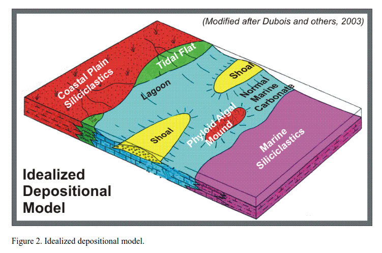
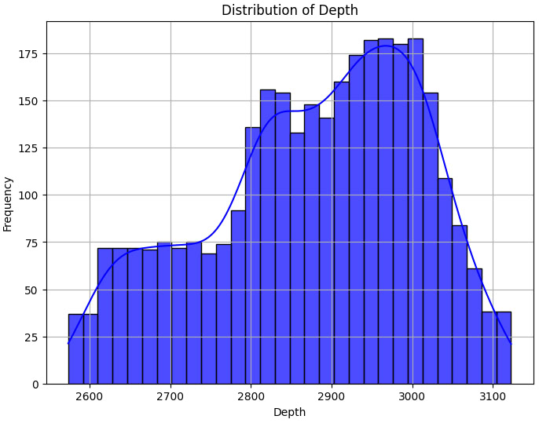
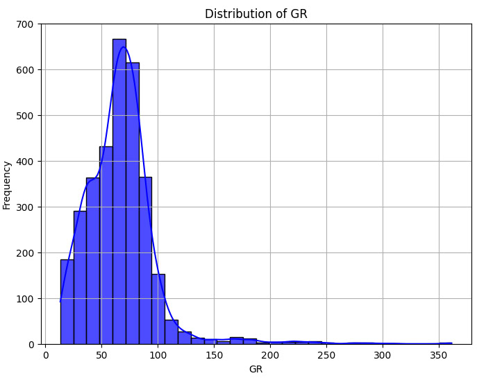
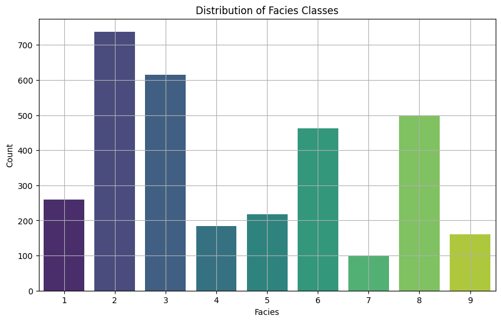
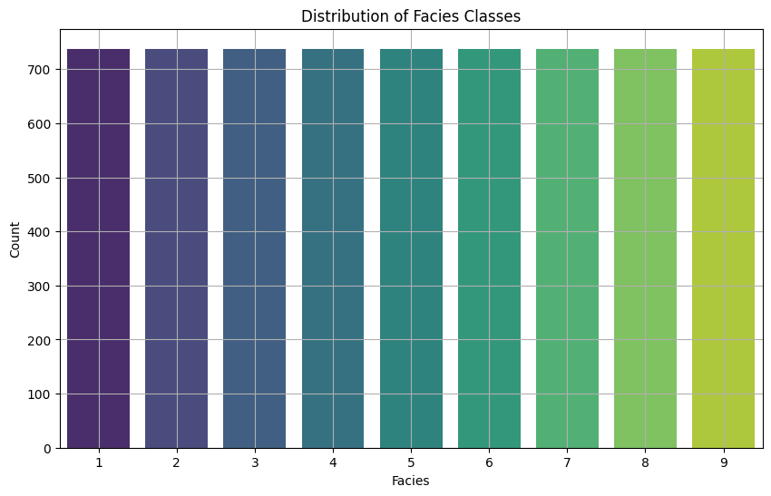
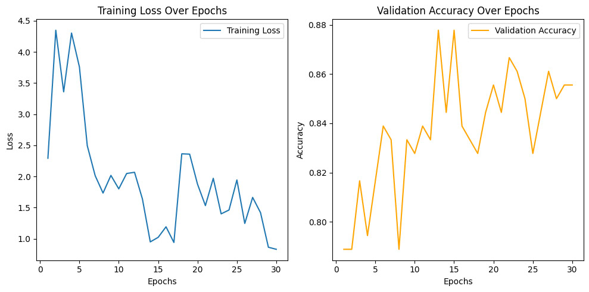
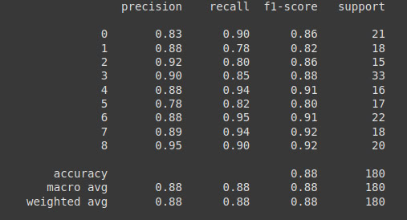

# Well Log Data Augmentation and Training with Transformer

## Pytorch Experience
[Github Repository](https://github.com/yutao-data/Transformer_Time_Series_Well_Log): Implementation of well log data augmentation and training using Transformer models.

---

## Data Source
- **Kansas Geological Survey Open File Report 2003-50**  
- **Authors**: G.C. Bohling and M.K. Dubois

---

## Exploratory Analysis
### Initial Data Visualization
  

### Facies Classes Distribution

---

## Data Augmentation
### Methods Applied:
- **SMOTE**: Synthetic Minority Oversampling Technique for balancing data.  
- **ELM**: Extreme Learning Machine, a fast neural network for classification.  
- **Bagging**: Ensemble method to reduce variance and improve model performance.

---

## Transformer Training
### Why Transformer?
- **Long-term dependencies**: Suitable for time-series data.  
- **Interpretability**: Clear insights into model decisions.  
- **Multivariate relationships**: Handles multiple variables effectively.  
- **Flexibility with sequence length**: Adaptable to varying time-series lengths.

### Training Results
  

---
